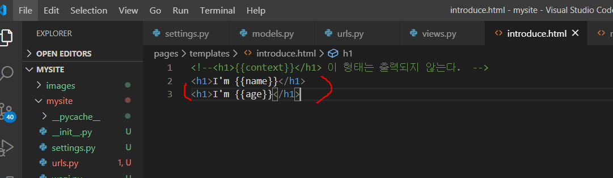

# Django


## 프로젝트 생성

* 현재 내가 위치한 곳에서 project를 만든다. (뒤에 .을 붙여주지 않으면, 폴더 안에 폴더 형식으로 생성된다.)

  ```bash
  django-admin startproject mysite .
  ```

* startapp pages 해주고 `settings.py` 에서 pages 앱 추가 해준다.

  ```bash
  django-admin startproject mysite .
  ```

  


* 서버를 켠다. 서버를 켜고, 다른 bash창을 이용해서 작업한다. 

```bash
python manage.py runserver
```


## 프로젝트 구성

* 세팅을 마친 후, url을 정의하여 경로를 지정한다. 

### urls.py


* 문자열로 path를 정의해준다.
* views.py에 있는 함수를 불러온다는 뜻이다. 그런데, 함수명 뒤에 괄호가 없다. 함수명만 넘겨줘야 하기 때문에 괄호가 없다 (괄호가 있으면 실행한다는 뜻이므로)


### views.py

* 요청을 처리하기 위한 함수를 정의한다. 


* mysite 안의 pages에 templates라는 폴더를 만들어준다. 


이번엔 hello라는 함수를 정의한다. 먼저 url부터 정의한다.


그 다음은 hello 함수를 만든다.

* 딕셔너리 형태로 보내면, key값에 대한 value를 html에서 받을 수 있다. 


* 변수에 담아서 보낼 수 있다.


* 여러 값을 보내야 할 때는 딕셔너리 형태로 만든다.

  

  

* 딕셔너리의 key값을 적어주면 value를 출력할 수 있다. (단, 딕셔너리 변수명 그대로는 접근할 수 없다. )

  


* 넘겨주는 변수 개수 상관없이 딕셔너리 형태로 보내면 나중에 편리하다.
* 딕셔너리명도 웬만하면 context로 통일해서 사용 


### request 랑 같이 넘겨주기


### 변수를 주소창으로 여러 개 넣어서 보내기


* path를 정해줄 때는 tring은 `<str:변수명>` 으로, int는 `<int:변수명>` 으로 구분해준다. 


* DTL을 사용하여 html내에서 for문을 사용할 수 있다. 중괄호 안에 %를 적는다. 

  

* 렌더링한 html안에서 주석을 쓰면, 오류가 난다. 웬만하면 주석은 사용하지 않는다. 


* 주석을 표현하려면,

  1) 파이썬의 주석처럼 `{#    #}` 로 표현한다. 

  * 개발자 도구에서 해당 주석이 나온다.

    

  2) `comment`

  * 개발자 도구에서 해당 주석이 나오지 않는다. 

```html

	여기는 전부
	출력이 안됨

```


### DTL : Django Template Language


* `forloop counter` : 내가 지금 몇번째 반복문을 하고 있는지 알려준다.

  '몇 번째' 인지 알려주는 거라서 index값 시작인 0이 아니라 1부터 시작된다. 


#### if문


* forloop.first, forloop.last


#### 


*** 주의사항 ***

* 조건 걸 때, 변수와 `==` 을 붙여쓰면 오류가 난다. 무조건 변수와 `==`  사이에 공백을 줘야 한다. 


#### Filter

* 파이프라인 (shift + `\`) 를 활용한다.


* truncate 는 자르는 기능을 한다.
  * `truncatewords:단어수지정` : n단어 까지만 나오고, 나머지는 `...` 으로 출력된다.
  * `truncatechars:글자수지정` : `...`을 포함해 총 n글자가 나오게 한다.


#### lorem

* 의미없는 글을 채워넣을 수 있다.


## 예제


<h3>1. 간단한 반복문으로 리스트 각 요소들을 출력</h3>

```html

    <p>{{item}}</p>

```


<h3>2.if, else 활용해서 문자열 비교</h3>

```html

    <p>{{data_a}}와 {{data_b}}의 문자열이 같다.</p>

    <p>{{data_a}}와 {{data_b}}의 문자열은 다르다. </p>


```


<h3>2-1. 내가 넘긴 문자열과 특정한 문자열 비교</h3>

```html

    <p>admin입니다.</p>

    <p>일반회원입니다. </p>


```


<h3>3. if, elif, else 사용해보기 : 문자열의 길이가 5이하면 short,문자열의 길이가 10이상이면 long,모두 아니면 적당 출력 </h3>

```html

    <p>{{thing}}의 길이는 {{thing|length}} : short</p>

    <p>{{thing}}의 길이는 {{thing|length}} : long</p>

    <p>{{thing}}의 길이는 {{thing|length}} : 적당합니다. </p>

```


<h3>4. 반복문으로 리스트 각 요소들을 출력해서 A:90이상, B:50이상, C:그외 출력</h3>

```html

    
        <p>점수:{{item}} => A</p>
    
        <p>점수:{{item}} => B</p>
    
        <p>점수:{{item}} => C</p>
    

```

