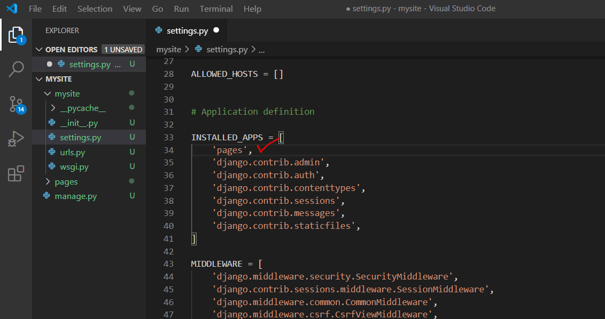
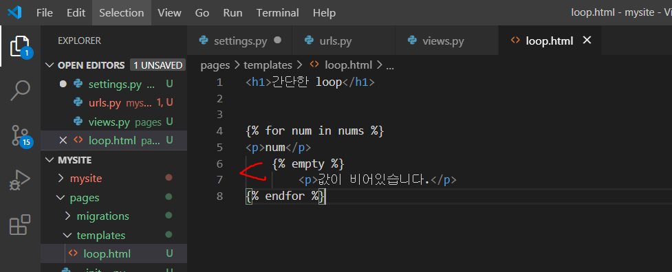
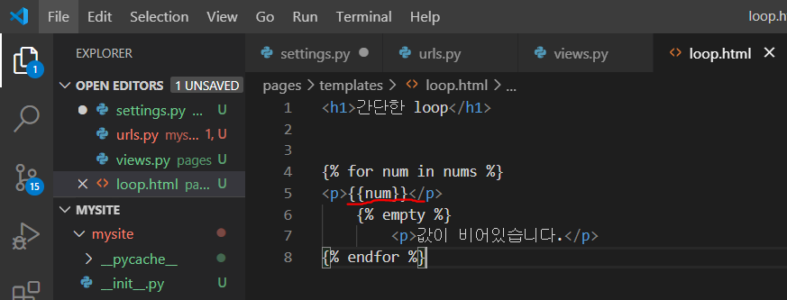

* 프로젝트를 만든다.

django-admin startproject 프로젝트명


mysite디렉토리로 들어간다. 


* 어플리케이션 만들기 :

python manage.py startapp 만들app이름


* settings.py에 내가 만든 app이름을 출생신고 




* settings.py에 내가 등록하는 어플리케이션 순서에 따라, 읽어나가는 순서가 결정된다.  참조 순서


* view에 접근할 수 있도록 urls.py 에 view파일을 임포트 해준다.


* variable routing을 통해 주소로 값을 전달해 줄 수 있다.


* view에서 함수를 정의해 준다.
  요청에 대한 처리를 해줘야 하기 때문에 parameter에는 `request` 가 있고, 받아온 변수까지 적어준다. 

  


* html로 값을 전달할 때, 딕셔너리 형태로 변수들을 묶어서 보낼 수 있다.
  이 때 렌더링(`render`) 을 통해 받아온 요청과 최종적으로 보여줄 html파일을 보여주면서 같이 넘겨준다. 


* html문서들을 저장할 폴더를 만든다. (폴더명 : templates)

  


* loop.html에서 DTL을 통해 view를 구성해 준다.


* `empty` 를 통해 값이 비어있는 경우에 대한 예외처리를 해줄 수 있다.




* 변수와 같은 값을 보여줄 때는 중괄호 두개 ( `{{변수명}}`) 를 사용한다.

  

  


* 서버를 실행해본다.

  ```bash
  $ python manage.py runserver
  ```

  


* 주소창에 내가 정의한 주소를 입력한다. 전달해 줄 변수도 정의한다.

  

  

  * 0을 입력하면 empty에 해당하는 기능이 수행된다. 

    


---

## GET방식으로 데이터 전송

> 요청 주소를 throw와 catch로 하고, throw에서 값을 입력받으면 GET방식으로 catch에게 전달해 주는 기능을 구현한다.  catch에서는 전달받은 값을 출력해줄 수 있도록 구현한다. 


* `label` : 라벨링
  * `for=` 에는 연결할 부분의 id값을 적어준다. for에 적힌 id와 연결이 되면, 라벨을 눌렀을 경우 id값에 해당하는 곳으로 이동된다.


* `GET방식` : DB에 영향을 미치지 않는 요청을 할 때 사용한다. ex. 조회
  * `form` 태그의 `method=` 에 `GET` 을 적어준다. `action=` 속성에는 다음에 수행될 경로를 적어준다.
  *  `/catch/` 를 보면 경로를 상대경로로 적어줬기 때문에 같은 수준에 있는 catch를 찾아 수행한다. 
  * form으로 전송할 때는 쿼리 형태로 이동하게 된다. 이 때 `name` 속성에 적힌 이름으로 가게 되어 나중에 값을 찾을 때 name으로 구분하여 찾으면 된다.  


* 한편 dir을 통해`request.GET` 에는 어떤 메소드가 있는지 알아본다. 


* request.GET 을 보면 딕셔너리 형태로 출력됨을 알 수 있다. (딕셔너리는 아님. 단지 딕셔너리 형태로 나오는 것 뿐)
  *  이 중에 `get` 이라는 메소드가 있음을 알 수 있다. 이는 `get`을 사용해 내가 전달하고자 하는 값을 key, value형태에서 가져올 수 있음을 암시한다.


* 딕셔너리에서 key값을 통해 value를 가져오는 방법은 두 가지가 있다.
  * 1) ['키값']
  * 2) get('키값')
* 1번의 경우 value를 가져올 수 있지만, 만약 키 값이 없으면 오류가 발생한다.
* 2번의 경우 1번과 동일한 기능을 수행하며, 만약 키 값이 없는 경우 `none` 을 리턴하여 오류가 발생하지 않는다.
  * 그 중 따라서 사용자가 직접 작성한 텍스트를 받아올 껀데, 딕셔너리에서 키값으로 접근한 방법 중 get()을 사용한 이유는 빈 값을 넘겨줄 경우 오류가 발생하지 않고 서버가 잘 작동하기 위해서이다.
  * url로 catch를 직접 쳤을 때 오류가 나면 안되니까 get()메소드를 사용한다. catch를 직접 쳤을 때 전달받는 값이 없으므로 none이 data라는 변수에 저장되어 none이 나온다. 이 때, 사용자에게 잘못된 접근 방식이라는 등 안내메세지를 주면 완성도 높은 사이트가 된다. 


