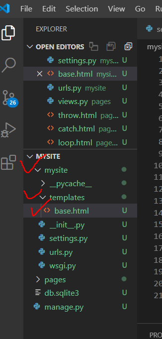

# 한 프로젝트에서 여러 app을 관리하기

> 한 프로젝트 내에서 여러 app을 등록하고 관리할 수 있다.


## 두 번째 앱 만들기


* 기존에 있었던 pages앱 말고 다른 앱을 만든다.
  (secondpages라는 이름으로 만들었다.)

  ```bash
  python manage.py startapp 만들앱이름
  ```

* settings.py에도 추가된 앱을 적어준다.

  


### include로 url 관리 설정

* 기존에는 큰 단위인 mysite의 urls.py에서 url을 관리했다. 하지만, app이 두 개가 되면서 import 시 views가 같은 이름으로 되어 구분을 할 수가 없다. 

* 따라서 `urls.py` 을 각 app에서 관리할 것이다. 이처럼 설정하기 위해 mysite의 urls.py `include`를 사용해 다음과 같이 코드를 수정한다.

  ```python
  from django.contrib import admin
  from django.urls import path, include
  
  
  
  urlpatterns = [
      
      path('pages/',include('pages.urls')),
      path('secondpages/', include('secondpages.urls')),
      path('admin/', admin.site.urls),
      
  ]
  ```

  


*  각 앱의 폴더 밑에 urls.py 파일을 만들어준다.

  * pages > urls.py

  

  

  * secondpages > urls.py

    

    

* 이렇게 각 app의 url을 urls.py에서 관리한다.
* 이어서 view에도 폴더 이름을 추가해 주어야 한다.


### html 파일들 경로 수정하기

* 각 폴더에 templates 폴더를 만들고, 그 밑에 app 이름과 똑같은 폴더를 만들어 그 아래에 html파일을 관리한다.

  * pages > templates > pages > html파일들

  

  

  * secondpages > templates > secondpages > html파일들

    


### views 경로 수정하기


### 사이트 접속하기

* url을 수정해주었기 때문에, 수정한 url대로 접속을 시도한다.

  

* 화면이 제대로 출력됨을 알 수 있다.


## 템플릿 만들기

### 템플릿 base 만들기

* 프로젝트 mysite 안에 templates 폴더를 만들고 base.html을 만든다. 




### 구역 설정하기


템플릿을 만들 `block`을 만들어준다. 여기서 title, body는 내가 임의로 정한 이름이다. 

* 컨테이너 디비전 만들기


* 만들 때 bootstrap에서 cdn을 가져와서 적어준다. css는 head에, js는 body에 적어준다.
* container를 만들어준다. 여기에 내용이 들어가게 된다. 


### 템플릿 등록하기

* settings.py에 템플릿 경로를 적어줘야 한다. 

* TEMPLATES 항목 `'DIRS'` 에 다음과 같이 적어준다.

  ```python
  'DIRS' : [os.path.join(BASE_DIR,'mysite','templates')],
  ```


* mysite는 프로젝트 이름이자, 경로다. os에 맞춰서 mysite에 있는 templates폴더를 적용하겠다는 의미

* mysite의 templates 

* APP_DIRS가 True로 되어있기 때문에 해당 기능을 수행할 수 있다. 


### 템플릿 적용하기

* 적용시키고 싶은 html 파일에 mysite의 templates안에 있는 html을 상속한다.

* ``  DTL을 사용하여 아까 내가 임의로 정의한 title, body 구역을 정해준다.

  ```python
  
  
      pagesIndex
  
  
  
  <h1>안녕하세요</h1>
  
  
  ```


실행결과


## App 간 페이지 연결하기

### name 정해주기

* urls.py에서 `app_name` 과 연결될 html경로 이름 `name` 을 정의


### a 태그를 활용해 연결

* urls.py에 정의한 `app_name` 과 `name` 을 가지고 a태그와 DTL을 활용해 연결

  * pages > index.html

  

  

  * secondpages > index.html

  


* 실행 결과

  

  여기서 [ 두 번째 인덱스 페이지 ]를 누르면 app_name과 name에 적힌 곳으로 이동하기 된다.

  


# 이미지 출력하기


alt내용을 가지고 시각장애인들에게 읽어주는 내용을 활용한다. 


# 프로젝트 만들기

* Project Name : mysite
* App Name : articles

## 페이지 생성

1. **index pages**
   * `/index/` : 전체 게시글 목록을 보여 줄 페이지
2. **create pages**
   * form 태그가 들어있는 사용자가 직접 입력하는 페이지
   * `/new/` 글 작성을 위한 form(제목, 내용) 입력 페이지
   * `/create/` 글 작성 결과(제목, 내용)를 출력하는 페이지

---

## 추가

1. **base template**

   * 모든 템플릿들이 상속 받을 baes.html

     

## 주의 사항

1. **urls.py 설정 분리**

   * app_name 도 함께 설정

2. **template 폴더 구조**

   