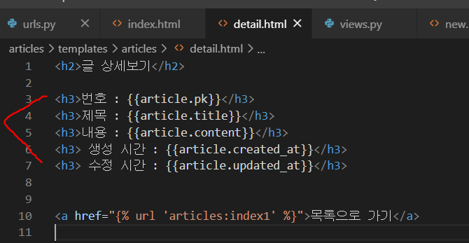
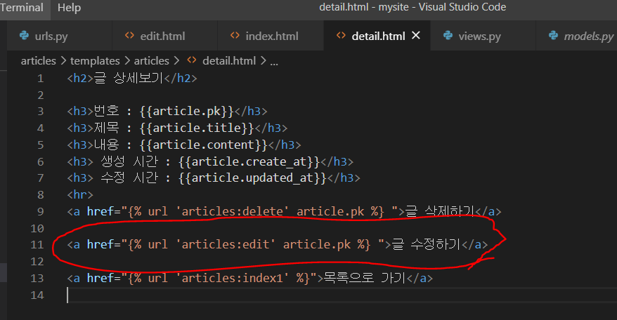

* makemigrations

  ```bash
  $ python manage.py makemigrations
  ```

  


* `migrate` : 내가 작성한 스키마대로 DB에 테이블 생성하기. DB에 반영하기

  ```bash
  $ python manage.py migrate articles
  ```

  


* 생성 확인 : articles > migrations > 0001_initial.py

  


DB에 변화점이 있다면, migrations 폴더의 내용을 보면 된다. 버전이 생성되어 버전 관리를 할 수 있다. 


---

DB접근하는 shell창 접근. 단, migrate 작업에 문제가 없어야 한다. 

```bash
python manage.py shell
```


현재 models.py에 Article로 정의되어 있다. 

```bash
 from articles.models import Article
```


빈 쿼리셋이 나오면 잘 작동한 것이다.

만약 오류가 난다면, models.py에 변경사항이 있는지 보고 다시 makemigration부터 수행해주면 된다. 


# Django ORM

## CREATE

**1. INSERT INTO TABLE (column1, column2...) VALUES(values1, values2...)**

```python
# 첫 번째 방법

article = Article()

article.title = 'first'

article.content = 'django!'

article.save()


```


```python
# 두 번째 방법
# 어느 변수에 어떤 값을 넣을건지 명시
# id가 생략되어 있을 뿐, 자동으로 생성된다.
article = Article(title='second', content='django!!!!')
article.save() 

```


```python
# 세 번째 방법
# 한 줄로 생성 및 저장까지 완료하는 방법
Article.objects.create(title='third', content='third Django!')
```


## READ

**2. SELECT \* FROM articles_article**

```python
article = Article.objects.all()
```


**3. SELECT * FROM articles_article where titles='first'**

```python
# 특정 제목 불러오기
Article.objects.filter(title='first') #이렇게 하면 여러개 나온다.
Article.objects.filter(title='first').first() # 첫번재 값만 불러오기
Article.objects.filter(title='first').last() # 마지막 값만 불러오기
Article.objects.filter(title='first')[0] #인덱스로 접근하기 
```


PK로 가져오는 방법

**SELECT * FROM articles_article WHERE id =1 **

```python
Article.objects.get(id=1)
Article.objects.get(pk=1)
# ----주의점----
# 고유값이 아닌 내용을 필터링 해서 2개 이상의 값이 찾아지면 오류를 발생한다. 
# .get()은 항상 하나의 객체로서 가져오는 거라서 꼭 하나의 값만 가져오는 상황에서 쓰자.
# 없는 것을 가지고 오려고 해도 오류가 발생한다. 
```


* 없는 값 찾으려고 할 때 get은 오류가 나지만, filter는 오류가 나지 않고 빈 쿼리셋 리턴


**Like / startwith / endswith**

* `Article.objects.filter(컬럼명__contains="문자열")`

```python
# 특정 문자열을 포함하고 있는가?
Article.objects.filter(title__contains='fir')
Article.objects.filter(title__startswith="se")
Article.objects.filter(content__endswith="ha")
```


## UPDATE

**UPDATE article_article SET title='byebye' WHERE id=1**

```python
# 수정
article = Article.objects.get(pk=1)
article.title = 'byebye'
article.save()
```


## DELETE

**DELETE FROM articles_article WEHRE id=1**

```python
# 삭제
article = Article.objects.get(pk=1)
article.delete()
```


## 정렬

**ASC / DESC**

```python
Article.objects.all().order_by('pk') #오름차순
Article.objects.all().order_by('-pk') #내림차순
Article.objects.all()[::-1] #내림차순 , 이미 가져온 쿼리셋을 파이썬에서 처리한다. 
```


---

```python

```

csrf : 사이트 간 요청 위조

를 방지하기 위해서 csrf_token을 함께 넘겨준다. (없어도 전송에는 무방하다. ) 


# POST


---


# 게시판 만들기


## 게시 글 상세보기 기능

> 게시글 목록에서 제목을 클릭하면 내용을 볼 수 있는 상세 페이지로 이동한다. 


```python
	# 1. 상세페이지를 보기위한 경로
    # 1-1. 특정 게시물에 대한 고유 값
    # 1-2. /articles/1/, /articles/2/
    # /articles/{{article.pk}}/
    # 
    # 2. 해당 게시글에 대한 상세 내용
    # 2-1. 게시글의 pk, title, ....
    # 3. 인덱스 페이지로 돌아가는 링크
```


* 접근 링크 생성

  

  * 주소로 이동할 때, 값을 detail 뒤에 붙여서 같이 넘겨주면 된다. 
  * name을 설정해주었기 때문에, 'article:detail' 이렇게만 적어주면 된다.


* 경로 설정


* view에서 def 정의

  

  

* detail.html 만들기

  


## 게시글 삭제 기능

```python
# 1. 특정 글 삭제를 위한 경로 생성
# 1-1. /articles/1/delete/
# 2. 글 삭제 처리를 해주는 view 작성
# 3. 글 삭제 후, index page로 redirect
# 4. 글 삭제를 위한 링크 detail에 작성
```
* 경로 생성

  


* detail.html 에 접근 경로 만들어주기

  

  * 여기서 url을 적어줄 때, `"/articles/{{article.pk}}/delete/"` 도 동일하게 작동한다. 


* views.py에 기능 작성


## 게시글 수정하기 기능

```python
# 1. 특정 글 수정을 위한 경로 생성
# 1-1. /articles/1/edit/
# 2. 글 수정 template을 render하는 edit view 작성
# 2-1. 해당 template에 form tag 작성
# 2-2. 각 intput tag 내부에 기존 내용이 들어있어야 함.
# 3. edit 보낸 데이터 처리를 위한 경로 생성
# 3-1. /article/1/update/
# 4. 글 수정 처리를 하는 update view 작성
# 5. 해당 글 상세 페이지로 redirect
# 6. 글 수정을 위한 edit 랭크 해당 글 상세 페이지에 생성
# 6-1. 

```


* 경로 설정 
  * `article/pk값/edit` : 글 수정하기 버튼을 누르면, edit.html 화면으로 넘어가도록 한다.
  * `article/pk값/update` :edit.html화면에서 POST방식으로 update를 요청하는 url을 작성한다. 


* datail.html 에 접근할 수 있는 경로를 적어준다. 

  


* 수정하기 버튼을 누르면, 수정할 수 있는 edit.html이 나오도록 설계

  


* edit.html에는 기존에 내가 작성했던 내용이 들어가 있어야 한다.

  

  * 기존 내용이 있고, 수정한 뒤에는 `POST` 방식으로 보낼 수 있도록 적는다.

  * url 요청 경로는 article/pk값/update로 하기에 DTL을 이용해 적어준다.

    

* input 태그에서 입력한 값을 POST로 보내고, 요청에서 받은 뒤 update할 수 있도록 기능을 작성한다. 

  


* 기능을 수행한 뒤에는 글 목록이 나오도록 `redirect `로 걸어준다.


---

# 게시판 만들기 전체코드

* models.py

  ```python
  from django.db import models
  
  # Create your models here.
  class Article(models.Model): #Model의 M은 대문자 (다른이름 넣으면 안됨)
      #Article 파이썬에서 클래스를 정의하는 컨벤션(앞에 대문자, 단수형)
      title = models.CharField(max_length=150) #글자수를 제한하고 싶을 때 
      content = models.TextField()
      create_at = models.DateTimeField(auto_now_add=True)
      updated_at = models.DateTimeField(auto_now = True)
  
      def __str__(self):
          return f'{self.id}번째 글 - {self.title} : {self.content}'
      
  ```

  

* urls.py

  ```python
  
  from django.urls import path
  from . import views
  app_name="articles"
  
  urlpatterns = [
      path('index/', views.index, name="index1"),
      path('new/', views.new, name="new"),
      path('create/', views.create, name="create"),
      path('<int:num>/', views.detail, name="detail"),
      path('<int:article_pk>/delete/', views.delete, name="delete"),
      path('<int:article_pk>/edit/', views.edit, name="edit"),
      path('<int:article_pk>/update/', views.update, name="update"),
      
      
  ]
  
  ```

  

* views.py

  ```python
  from django.shortcuts import render, redirect
  from .models import Article
  
  # Create your views here.
  
  def index(request):
      articles = Article.objects.all()
      context = {
          'articles' : articles
      }
      return render(request, 'articles/index.html', context)
  
  
  def new(request):
      return render(request, 'articles/new.html')
  
  
  def create(request):
      title = request.POST.get('article_title')
      content = request.POST.get('article_content')
      # 데이터 생성을 위한 ORM활용
  
      # 첫번째방법
      # article = Article()
      # article.title = title
      # article.content = content
      # article.save()
  
      # 두 번째 방법
      # article = Article(title = title, content = content)
      # article.save()
  
      Article.objects.create(title = title, content=content)
  
      # 어떤 방식을 사용했는가에 따라서 save()메소드를 사용할 것인지 아닌지
  
      
      return redirect('articles:index1') #app_name과 이름으로 
  
  
  
      # 1. 상세페이지를 보기위한 경로
      # 1-1. 특정 게시물에 대한 고유 값
      # 1-2. /articles/1/, /articles/2/
      # /articles/{{article.pk}}/
      # 
      # 2. 해당 게시글에 대한 상세 내용
      # 2-1. 게시글의 pk, title, ....
      # 3. 인덱스 페이지로 돌아가는 링크
  def detail(request, num) :
      numnum = num
      article = Article.objects.get(pk=numnum)  
      context = {        
          'article' : article
      }
      return render(request, 'articles/detail.html', context)
  
  
  
  # 1. 특정 글 삭제를 위한 경로 생성
  # 1-1. /articles/1/delete/
  # 2. 글 삭제 처리를 해주는 view 작성
  # 3. 글 삭제 후, index page로 redirect
  # 4. 글 삭제를 위한 링크 detail에 작성
  def delete(request, article_pk) :
      article=Article.objects.get(pk=article_pk)
      article.delete()
      return redirect('articles:index1')
  
  
  
  # 1. 특정 글 수정을 위한 경로 생성
  # 1-1. /articles/1/edit/
  # 2. 글 수정 template을 render하는 edit view 작성
  # 2-1. 해당 template에 form tag 작성
  # 2-2. 각 intput tag 내부에 기존 내용이 들어있어야 함.
  # 3. edit 보낸 데이터 처리를 위한 경로 생성
  # 3-1. /article/1/update/
  # 4. 글 수정 처리를 하는 update view 작성
  # 5. 해당 글 상세 페이지로 redirect
  # 6. 글 수정을 위한 edit 랭크 해당 글 상세 페이지에 생성
  # 6-1. 
  
  def edit(request, article_pk) :
      article=Article.objects.get(pk=article_pk)
      context = {
          'article' : article
      }
      return render(request, 'articles/edit.html', context)
  
  def update(request, article_pk) :
      new_title = request.POST.get('update_title')
      new_content = request.POST.get('update_content')
  
      article=Article.objects.get(pk=article_pk)
      article.title = new_title
      article.content = new_content
      article.save()
      return redirect('articles:index1')
  
  ```

  