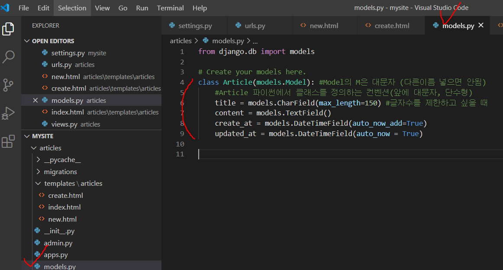


* makemigrations

  ```bash
  $ python manage.py makemigrations
  ```

  


* `migrate` : 내가 작성한 스키마대로 DB에 테이블 생성하기. DB에 반영하기

  ```bash
  $ python manage.py migrate articles
  ```

  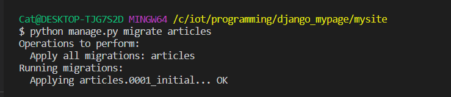


* 생성 확인 : articles > migrations > 0001_initial.py

  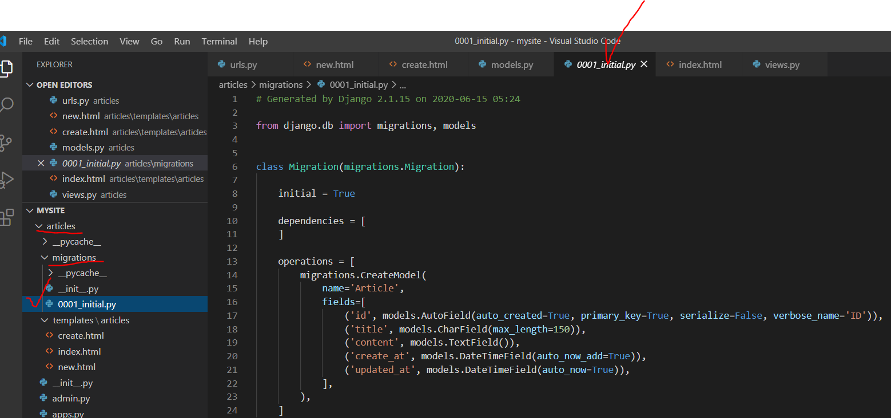


DB에 변화점이 있다면, migrations 폴더의 내용을 보면 된다. 버전이 생성되어 버전 관리를 할 수 있다. 


---

DB접근하는 shell창 접근. 단, migrate 작업에 문제가 없어야 한다. 

```bash
python manage.py shell
```

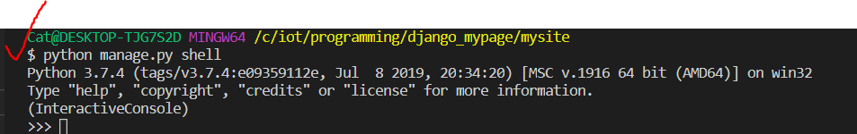


현재 models.py에 Article로 정의되어 있다. 

```bash
 from articles.models import Article
```


빈 쿼리셋이 나오면 잘 작동한 것이다.

만약 오류가 난다면, models.py에 변경사항이 있는지 보고 다시 makemigration부터 수행해주면 된다. 


# Django ORM

## CREATE

**1. INSERT INTO TABLE (column1, column2...) VALUES(values1, values2...)**

```python
# 첫 번째 방법

article = Article()

article.title = 'first'

article.content = 'django!'

article.save()


```


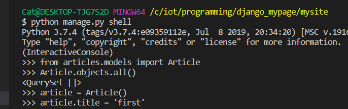

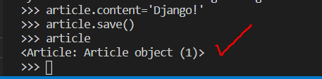


```python
# 두 번째 방법
# 어느 변수에 어떤 값을 넣을건지 명시
# id가 생략되어 있을 뿐, 자동으로 생성된다.
article = Article(title='second', content='django!!!!')
article.save() 

```


```python
# 세 번째 방법
# 한 줄로 생성 및 저장까지 완료하는 방법
Article.objects.create(title='third', content='third Django!')
```

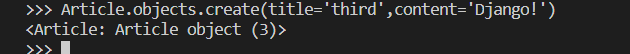


## READ

**2. SELECT \* FROM articles_article**

```python
article = Article.objects.all()
```


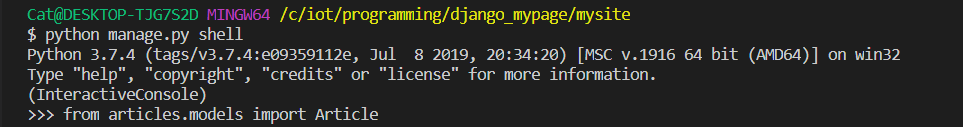

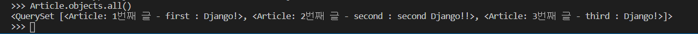


**3. SELECT * FROM articles_article where titles='first'**

```python
# 특정 제목 불러오기
Article.objects.filter(title='first') #이렇게 하면 여러개 나온다.
Article.objects.filter(title='first').first() # 첫번재 값만 불러오기
Article.objects.filter(title='first').last() # 마지막 값만 불러오기
Article.objects.filter(title='first')[0] #인덱스로 접근하기 
```


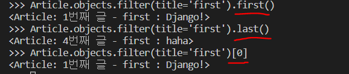


PK로 가져오는 방법

**SELECT * FROM articles_article WHERE id =1 **

```python
Article.objects.get(id=1)
Article.objects.get(pk=1)
# ----주의점----
# 고유값이 아닌 내용을 필터링 해서 2개 이상의 값이 찾아지면 오류를 발생한다. 
# .get()은 항상 하나의 객체로서 가져오는 거라서 꼭 하나의 값만 가져오는 상황에서 쓰자.
# 없는 것을 가지고 오려고 해도 오류가 발생한다. 
```

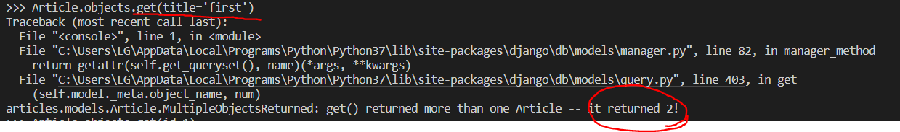

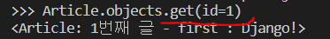


* 없는 값 찾으려고 할 때 get은 오류가 나지만, filter는 오류가 나지 않고 빈 쿼리셋 리턴


**Like / startwith / endswith**

* `Article.objects.filter(컬럼명__contains="문자열")`

```python
# 특정 문자열을 포함하고 있는가?
Article.objects.filter(title__contains='fir')
Article.objects.filter(title__startswith="se")
Article.objects.filter(content__endswith="ha")
```


## UPDATE

**UPDATE article_article SET title='byebye' WHERE id=1**

```python
# 수정
article = Article.objects.get(pk=1)
article.title = 'byebye'
article.save()
```

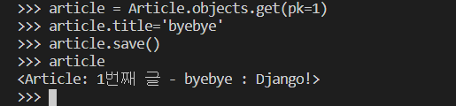


## DELETE

**DELETE FROM articles_article WEHRE id=1**

```python
# 삭제
article = Article.objects.get(pk=1)
article.delete()
```


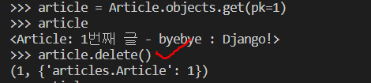

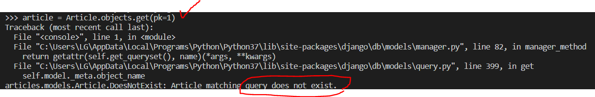