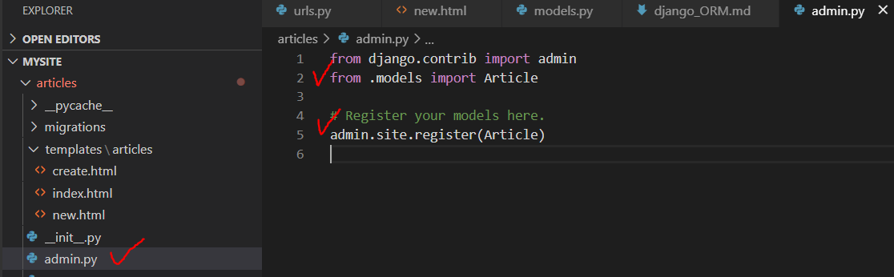
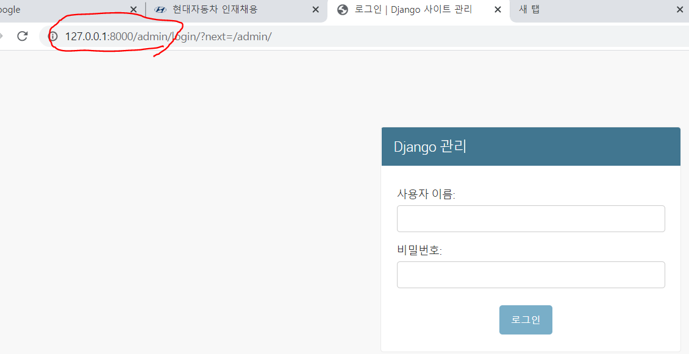
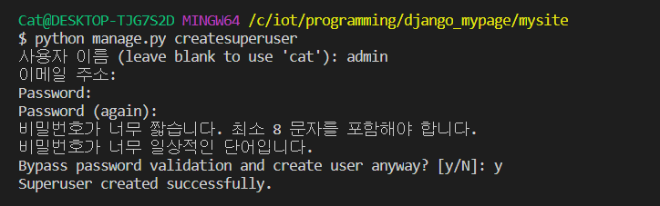
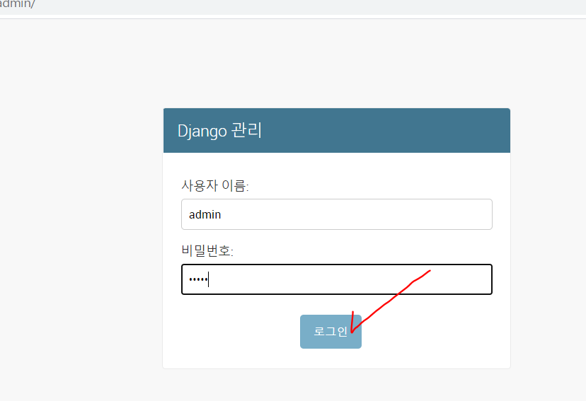
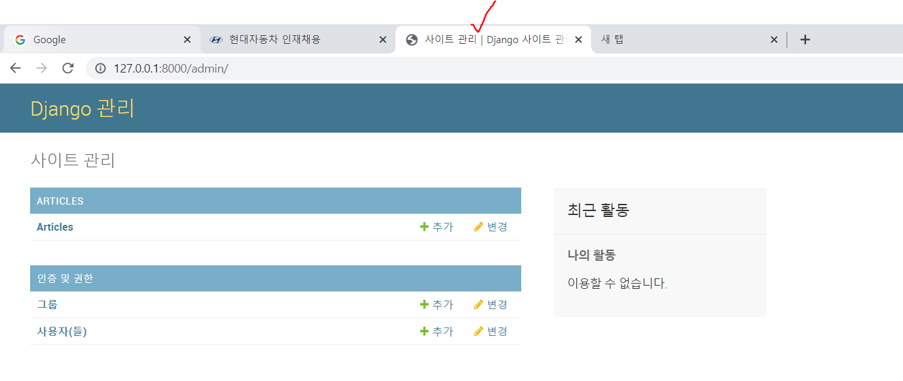
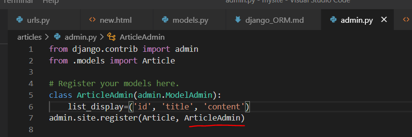
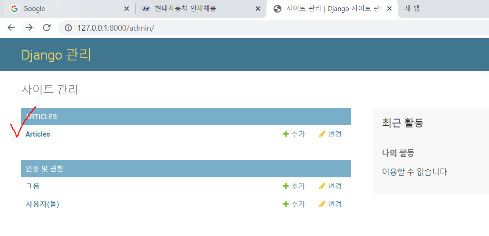
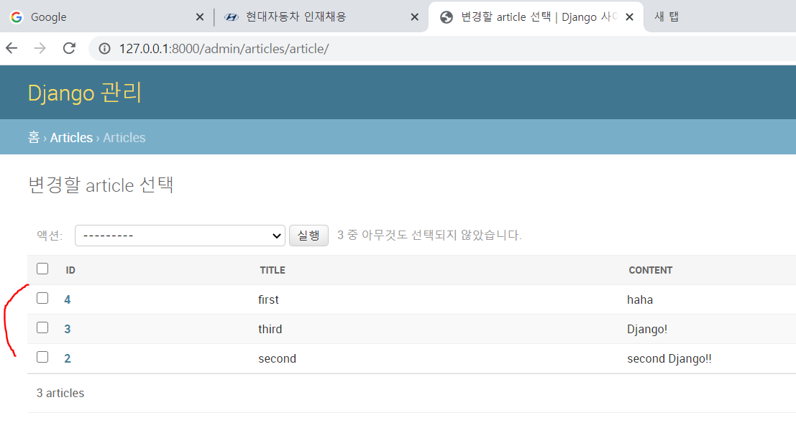

## 1. 관리자 페이지 설정하기




* 서버 키고 접속해보기 




* createsuperuser 생성

  ```python
  python manage.py createsuperuser
  ```

  * 만약에 오류나면, python manage.py migrate로 전체 마이그레이트를 해준다.

  

* 관리자 로그인 해보기

  

  




* 컬럼 넣어주기

  






