* app 만들기 명세서

https://drive.google.com/file/d/127g-B9Huygm4ULtV2UdaQoBpKi4OQA8y/view


# Form

* models.py가 있는 곳에 forms.py 파일을 추가한다. 

* ArticleForm을 만들어준다. 

  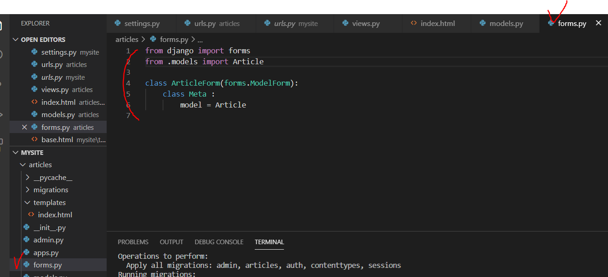


metadata : 데이터의 데이터


* views.py 에 import 해준다. 

  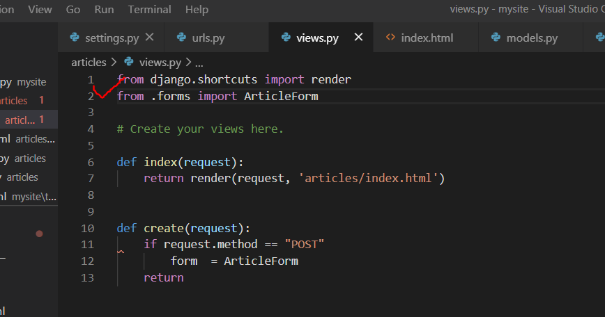


* create 메소드와 view를 만들어준다.

  

  

  * 요청 방식이 POST일 경우, 정보들을 받아서 form에 넣는다.
    (여기서 `ArticleForm` 은 내가 forms.py에 정의해 놓음)
  * `is_valid()` 메소드 : form값이 유효하면 True 가 리턴되고, `.save()` 를 통해서 저장한다. 

  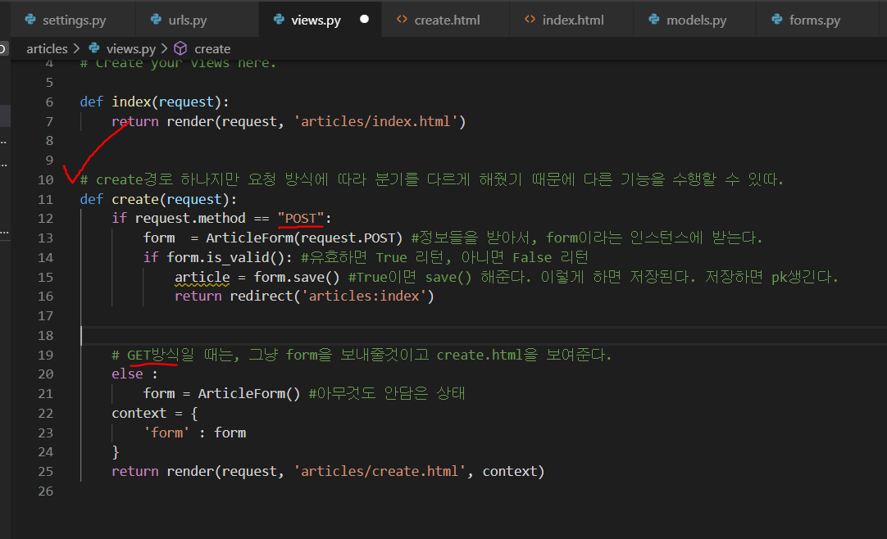

  * create경로에서 두 개의 기능을 수행한다.
    * POST인 경우: 정보를 저장한다.
    * GET 인 경우 : 그냥 form을 보내주고 create.html을 보여준다.  

  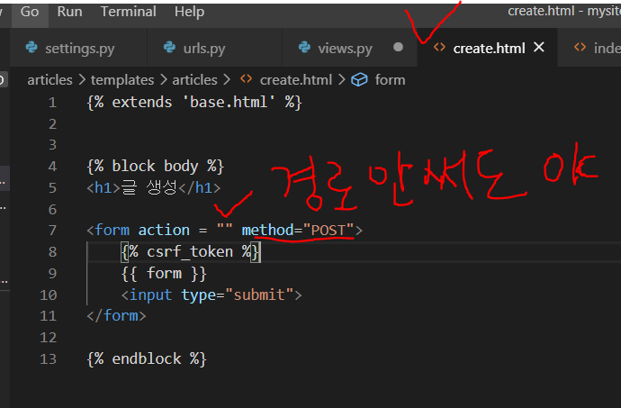


* 실행결과

  * GET의 경우, 그냥 사이트 보여주는 역할(주소창에 치고 들어가보자)

    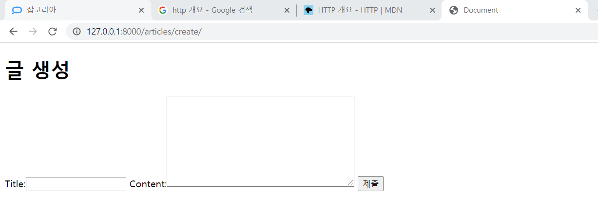

  * POST의 경우, 제출버튼을 누르면 수행되고 값이 전송되며 index페이지 redirect

    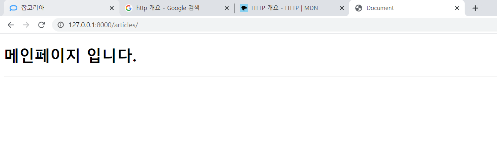

### 글 상세보기 페이지


* 경로를 작성해준다. 

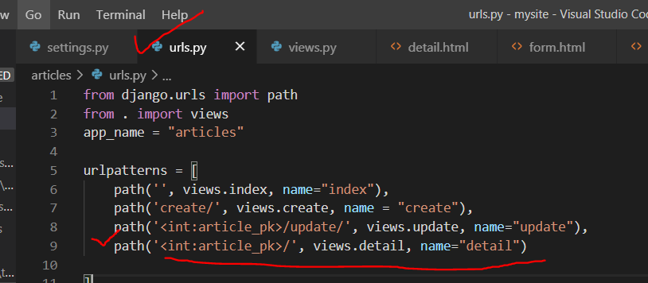


* views.py에 기능을 작성한다.

  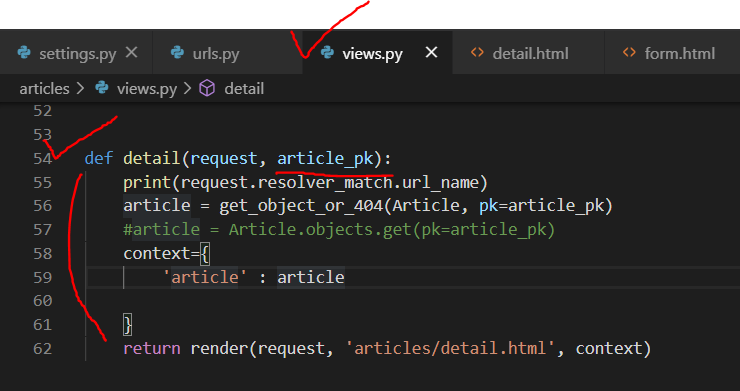

* `resolver_match` : 사용자가 들어온 경로, url name을 번역해 주는 메소드. 지금은 그냥 테스트 해보려고 print로 찍어본 것이다. 나중에 form.html에서 사용할 예정

  렌더링 할 때 항상 넘겨줬던 request 가 있으므로 request.resolver_match를 쓸 수 있다.

* `get_object_or_404` : db 값이 없을 경우 500 에러가 뜨는데, 404에러로 뜰 수 있게 수정 

  * 사용하려면, import 를 해줘야 한다.

    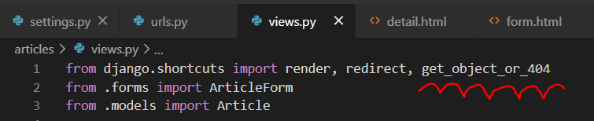

  

* detail.html 파일 작성

  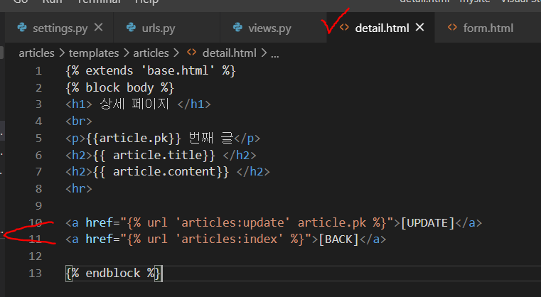

  

  

  

  


### 수정 페이지

> 글 생성 페이지와 수정 페이지 모양은 같다. 
>
> 따라서 수정페이지 html은 따로 만들지 않고, 생성 페이지를 이용한다.
>
> create.html을 form.html로 수정한 뒤 작업을 시작한다.


* 경로를 작성해준다.

  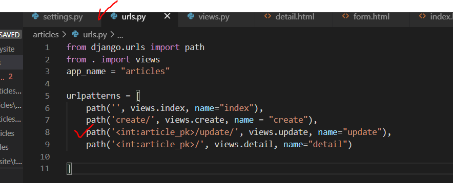


* view를 작성한다.

  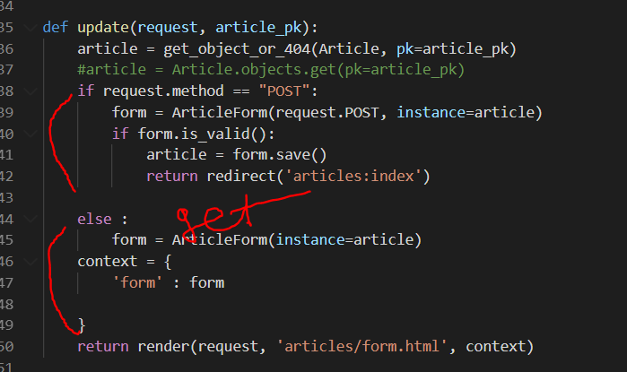
  
  * get방식으로 페이지 접근 시 form.html을 보여준다.
  * 그 화면에서, 버튼을 누르면 POST로 값을 보내어 POST일 때 구문이 실행된다.


* form.html 작성

  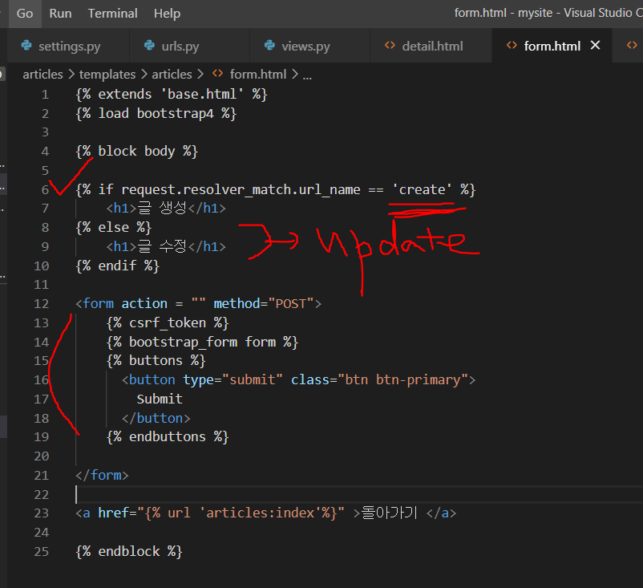

  * 'create' 경로 요청일 경우는 "글 생성" 을 보여주고, 나머지(update)경우에 수정페이지여야 하므로 "글 수정"을 보여준다.
  * 글 작성 form을 예쁘게 꾸미려고 bootstrap을 설치했다. 사용법은 다음 항목에서 설명


## 부트스트랩 사용하기

* django bootstrap4를 구글에 쳐서 들어간 뒤 installation항목을 확인하면 사용법이 나온다.

  * 사이트 접속 : https://django-bootstrap4.readthedocs.io/en/latest/

  * 파이썬에서 다음 명령어로 부트스트랩을 설치

    ```bash
    $ pip install django-bootstrap4
    ```

* 설치 뒤 템플릿으로 만든 base.html에 부트스트랩 관련 구문을 추가해준다.

  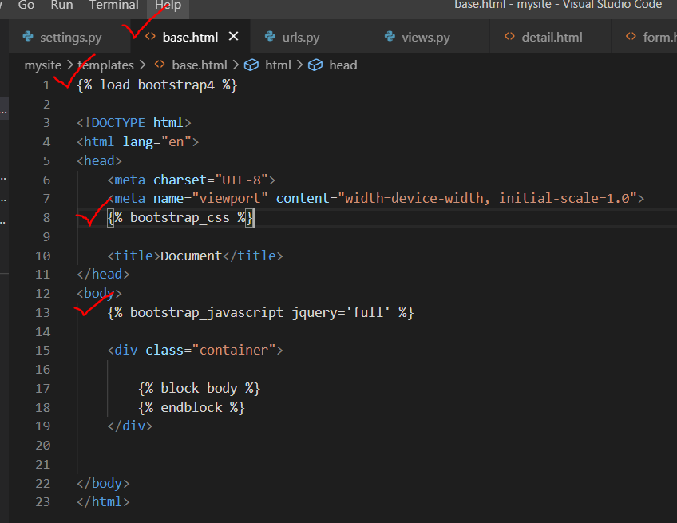

   

* form.html에 가서 예쁜 form을 만들어준다.

  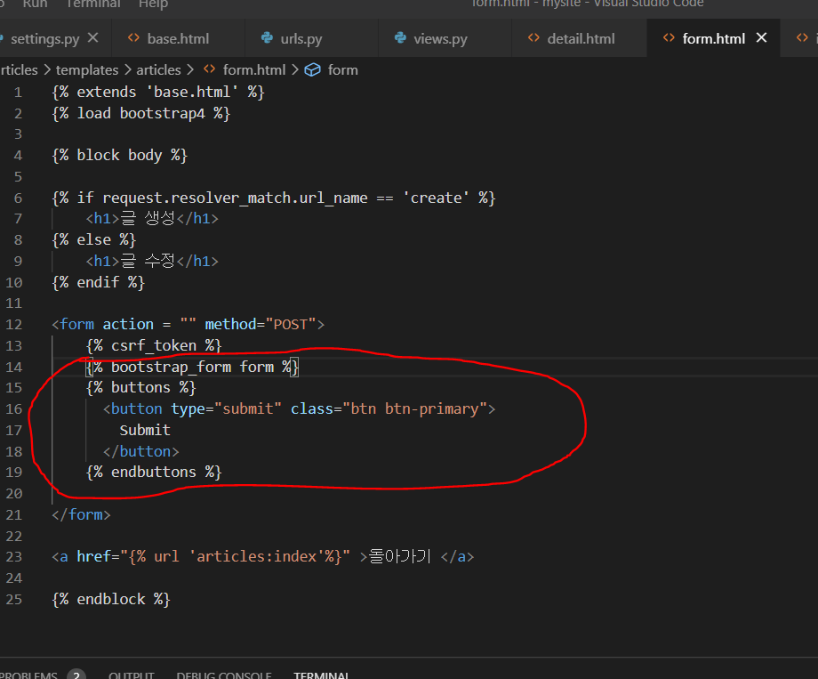


* 실행 결과

  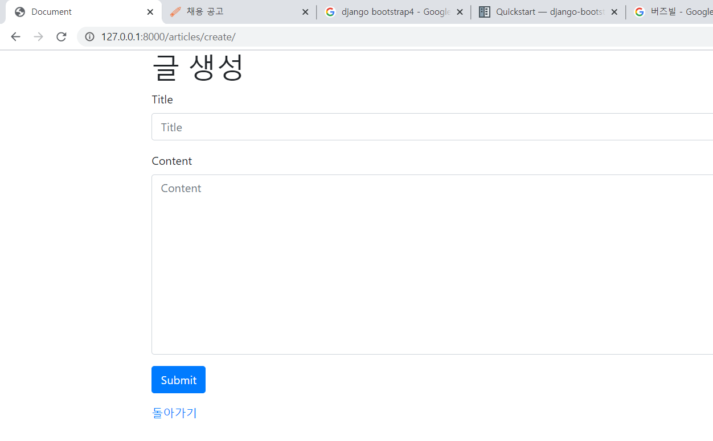

  이렇게 부트스트랩을 적용할 수 있다.


  `as.p` p태그로 묶어준다. 

